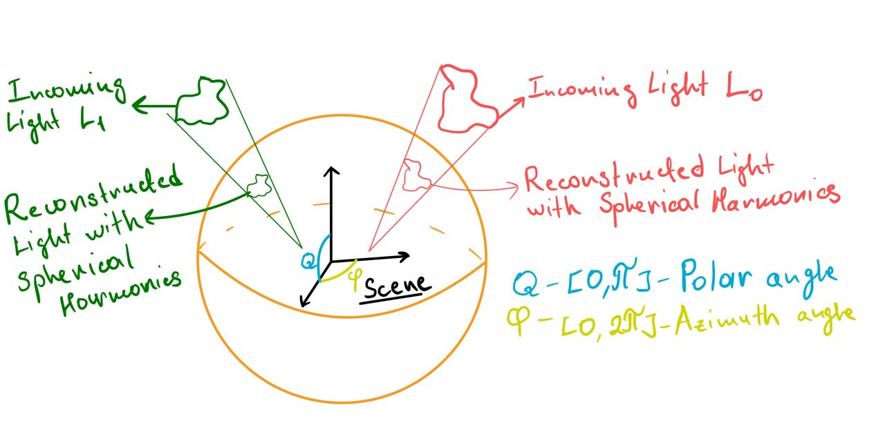
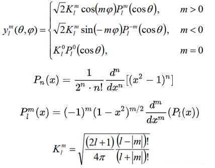

# Spherical Harmonics for Environment Map Lighting in PyTorch3D

This post explores a practical method for using spherical harmonics in scene illumination. Instead of directly calculating light from spherical harmonics, we'll convert them into a 2D UV environment map for efficient sampling. This approach transforms spherical harmonics into 2D image that can be easialy understood, analyzed and regularized.

## 1. Spherical Harmonics in Illumination
   - Brief introduction to spherical harmonics
   - Advantages in representing lighting environments

Imagine wrapping your entire scene in a giant bubble. Now, picture that this bubble isn't just plain - it's covered in a complex pattern of light and color. That's essentially what spherical harmonics help us do in computer graphics.
Spherical harmonics are like a special set of building blocks. Just as you can build complex Lego structures with a few basic pieces, we can describe intricate lighting patterns using these mathematical building blocks.
To figure out what's happening at any point on our imaginary bubble, we use two simple measures:

How far up or down the point is (that's our polar angle, θ)
How far around the bubble we've gone (that's our azimuth angle, φ)

With just these two pieces of information, we can map out the entire lighting environment surrounding our scene. It's like creating a super-efficient light map that tells us how bright and what color the light is coming from every direction.
The best part? This method gives us a compact way to store all this lighting info. Instead of trying to remember every tiny detail about the light, we just need to keep track of a few key numbers. It's like compressing a huge image file into a small, manageable size, but for lighting!

Here **on the image 1(CH)**, our scene is surrounded by this sphere. We have two light sources: *L_0* (a red light pattern) and *L_1* (a green light pattern). We can actually model these two light sources on the sphere surfaceby finding the right set of spherical harmonics coefficients. Let's take a closer look at the math behind this.

## 2. Converting Spherical Harmonics to Environment Maps
   - Mathematical overview
   - Implementation using PyTorch

For people who can read this high level math here is some brief anotation:

1. $y_l^m(θ, φ)$: Spherical harmonic function of degree l and order m.
   The degree l determines the overall complexity, while the order m (ranging from -l to l) specifies the number of azimuthal oscillations around the sphere.
2. $θ, φ$: Spherical coordinates (polar angle, azimuthal angle)
3. $K_l^m$: Normalization factor ensuring orthonormality of spherical harmonics.
4. $P_l^m$: Associated Legendre polynomial, defining the θ (polar) oscillation pattern and frequency.
5. $cos(mφ), sin(|m|φ)$: φ-dependent terms, creating azimuthal variation. These functions control the SH's oscillation around the equator, with $|m|$ determining the frequency of these azimuthal oscillations.

For other people who want to see light in the end of this chapter lets first understand concept of basis functions and where they used.

## 3. Scene Illumination with Environment Maps
   - Sampling the environment map
   - Calculating diffuse lighting
   - Calculating specular reflections

## 4. Implementation with PyTorch3D
   - Overview of the `EnvMapLighting` class
   - Integration with PyTorch3D's rendering pipeline

## 5. Conclusion
   - Recap of the benefits of spherical harmonics and environment map lighting
   - Potential future improvements or applications