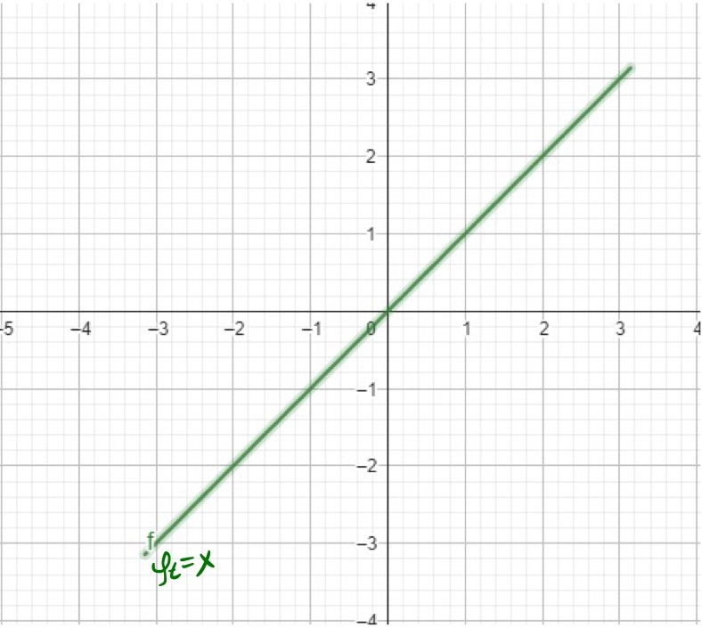
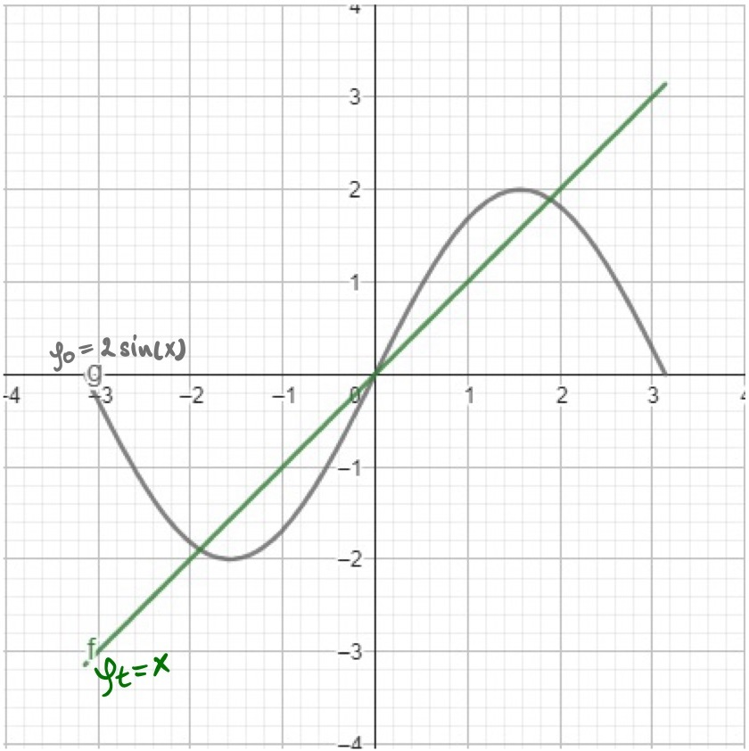
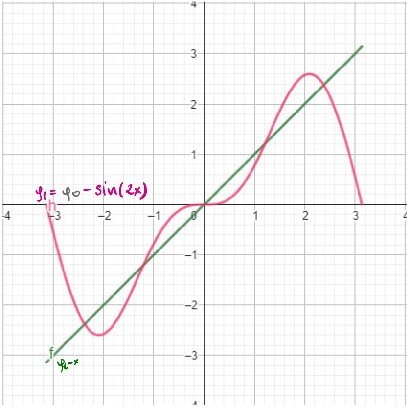
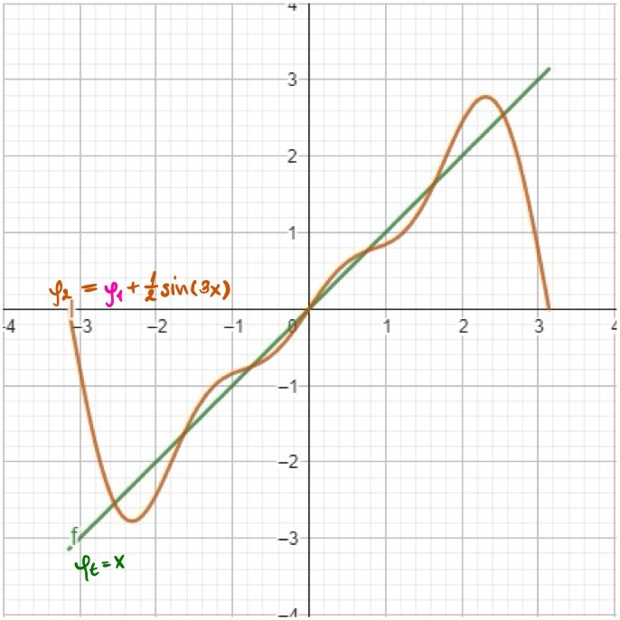
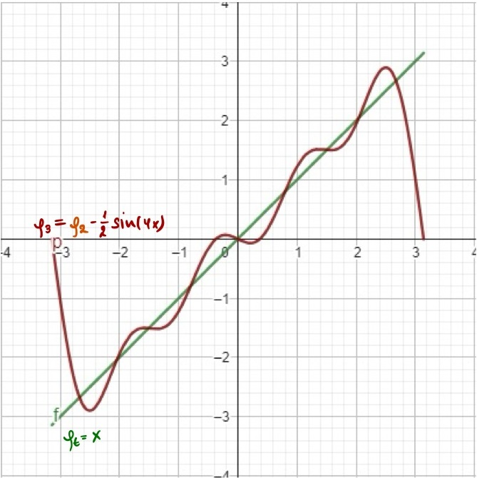
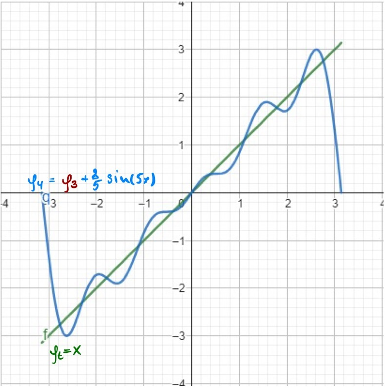

# Spherical Harmonics for Environment Map Lighting in PyTorch3D

This post explores a practical method for using spherical harmonics in scene illumination. Instead of directly calculating light from spherical harmonics, we'll convert them into a 2D UV environment map for efficient sampling. This approach transforms spherical harmonics into 2D image that can be easialy understood, analyzed and regularized.

## 1. Spherical Harmonics in Illumination
   - Brief introduction to spherical harmonics
   - Advantages in representing lighting environments

Imagine wrapping your entire scene in a giant bubble. Now, picture that this bubble isn't just plain - it's covered in a complex pattern of light and color. That's essentially what spherical harmonics help us do in computer graphics.
Spherical harmonics are like a special set of building blocks. Just as you can build complex Lego structures with a few basic pieces, we can describe intricate lighting patterns using these mathematical building blocks.
To figure out what's happening at any point on our imaginary bubble, we use two simple measures:

How far up or down the point is (that's our polar angle, θ)
How far around the bubble we've gone (that's our azimuth angle, φ)

With just these two pieces of information, we can map out the entire lighting environment surrounding our scene. It's like creating a super-efficient light map that tells us how bright and what color the light is coming from every direction.
The best part? This method gives us a compact way to store all this lighting info. Instead of trying to remember every tiny detail about the light, we just need to keep track of a few key numbers. It's like compressing a huge image file into a small, manageable size, but for lighting!

  

Representation of spherical harmonics on the sphere

Here **on the image 1(CH)**, our scene is surrounded by this sphere. We have two light sources: *L_0* (a red light pattern) and *L_1* (a green light pattern). We can actually model these two light sources on the sphere surfaceby finding the right set of spherical harmonics coefficients. Let's take a closer look at the math behind this.

## 2. Converting Spherical Harmonics to Environment Maps
   - Mathematical overview
   - Implementation using PyTorch

  

Spherical Harmonic basis functions

For people who can read this high level math here is some brief anotation:

1. $y_l^m(θ, φ)$: Spherical harmonic function of degree l and order m.
   The degree l determines the overall complexity, while the order m (ranging from -l to l) specifies the number of azimuthal oscillations around the sphere.
2. $θ, φ$: Spherical coordinates (polar angle, azimuthal angle)
3. $K_l^m$: Normalization factor ensuring orthonormality of spherical harmonics.
4. $P_l^m$: Associated Legendre polynomial, defining the θ (polar) oscillation pattern and frequency.
5. $cos(mφ), sin(|m|φ)$: φ-dependent terms, creating azimuthal variation. These functions control the SH's oscillation around the equator, with $|m|$ determining the frequency of these azimuthal oscillations.

For other people who want to see light in the end of this chapter lets first understand concept of basis functions and where they used. Imagine we have a function to approximate:

   $$\phi_{t}(x) = x$$

This is one of the simplest functions we\`ve studied back in school. As our basis let\`s choose periodic function:

$$
   \phi_n(x) = sin(nx), n=1,2,3,...
$$

Our goal is to approximate $\phi_{t}$ as a linear combination of these basis functions:

$$
\phi_{t}(x) \approx a_0 \phi_0(x) + a_1 \phi_1(2x) + a_2 \phi_2(3x) + ... + a_n \phi_n(nx)
$$

The process of finding coefficients $a_0, a_1, a_2, ...$ is called the Fourier Series Expansion. It works by decomposing the target function into a sum of sine and cosine functions(in our example we use only sine functions) - **orthogonal basis functions**—and finding the coefficients by projecting the target function onto each basis function through integration. For sake of simplicity we consider interval $x \in [-\pi, \pi]$. We won\`t go into details towards how this coefficients is found, but lets see how with each new basis added we getting better approximation of our target function Im.

<!-- Row 1: Single image -->

  

Target function: &phi;t(x) = 2sin(x)

Using the Fourier Series Expansion we can find out first coefficient $a_0=2$, so our $\phi_0(x) = 2sin(x)$. As we can see on the image bellow $\phi_0(x)$ is doing a bit poor job approximating our target function. Let\`s throw into the mix second basis function $\phi_1(x) = sin(2x)$ and see how it will improve our approximation. The second order approximation is $\phi_1(x) = 2sin(x) - sin(2x)$. The countour of the function is getting closer to our target function.
<!-- Row 2: Two images -->

  
  

First approximation: φ₀(x) = 2sin(x) &nbsp;&nbsp;&nbsp;&nbsp; Second approximation: φ₁(x) = 2sin(x) - sin(2x)

Step by step adding new basis $\phi_2, \phi_3, \phi_4$ with coefficients $a_2=\frac{1}{2}, a_3=-\frac{1}{2}, a_4=\frac{2}{5}$ we getting better and better approximation of our target function. Each approximation occilates more frequently around the target function making approximation more accurate.
<!-- Row 3: Two images -->

  
  
  

Next order approximations: &phi;3(x), &phi;4(x), &phi;5(x)

$$
\text{Full equations for each approximation step:} \\
$$
$$
\begin{align*}
\phi_0(x) &= 2\sin(x) \\
\phi_1(x) &= 2\sin(x) - \sin(2x) \\
\phi_2(x) &= 2\sin(x) - \sin(2x) + \frac{1}{2}\sin(3x) \\
\phi_3(x) &= 2\sin(x) - \sin(2x) + \frac{1}{2}\sin(3x) - \frac{1}{2}\sin(4x) \\
\phi_4(x) &= 2\sin(x) - \sin(2x) + \frac{1}{2}\sin(3x) - \frac{1}{2}\sin(4x) + \frac{2}{5}\sin(5x)
\end{align*}
$$

What is cool about this approch is how we just threw in new basis function with new coefficients without recalculating all the previous ones. This is the power of **ORTHOGONALITY**. Because basis function does not influence each other we can just add new ones and find their coefficients **INDEPENDENTLY**. For us, computer people this word translates into parallelization. We can speed up our computations and also reuse previous iterations, nothing goes to waste. This is the same property that Spherical Harmonics poses. Those tricky formulas actually generate infinite set of basis functions that are orthogonal  btw each orther. Similar to what we used in our example. Basically, Spherical Harmonics basis function can be used to approximate any function. In our practical case is a lighting pattern around our scene. Hopefully orthogonality property of **SH** is more or less clear now, but what about those **degree** and **order**?

Enought of math for now, let\`s focus on how we can code these equations and see what patterns they represent.

## 3. Scene Illumination with Environment Maps
   - Sampling the environment map
   - Calculating diffuse lighting
   - Calculating specular reflections

## 4. Implementation with PyTorch3D
   - Overview of the `EnvMapLighting` class
   - Integration with PyTorch3D's rendering pipeline

## 5. Conclusion
   - Recap of the benefits of spherical harmonics and environment map lighting
   - Potential future improvements or applications
